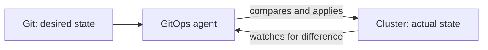

# Reconciliation and Drift

## Overview

At the heart of GitOps is a simple loop. An agent continuously compares two things, the **desired state** in Git and the **actual state** in the cluster, and works to make them match. That loop is called **reconciliation**.

---

## The reconciliation loop

The agent repeats this constantly: read Git, read the cluster, and if they differ, change the cluster to match Git. Git always wins.

---

## What drift is

**Drift** is any difference between the cluster and Git. It happens when someone changes the cluster directly, bypassing Git, for example scaling a deployment by hand.

Left unmanaged, drift is how systems become mysterious: nobody is sure why production looks the way it does, because changes were made outside any record.

---

## Self-healing

When the agent is set to **self-heal**, reconciliation does not just report drift, it **corrects** it. A manual change to the cluster is detected and reverted to whatever Git says. Manual tinkering simply does not stick.

This gives two guarantees:

- The cluster always trends back to the state described in Git.
- To change the system, you must change Git, so every change is reviewed and recorded.

---

## Why it matters

Reconciliation turns "deploy" from a one-time action into a continuous property. The system is not just deployed correctly once, it is **kept** correct, indefinitely, without anyone watching over it.

---

## Next

- [GitOps Principles](gitops-principles.md) for the ideas behind the loop.
- The [Drift and Self-Healing](../../tutorials/advanced/drift-self-healing.md) tutorial shows it in action.