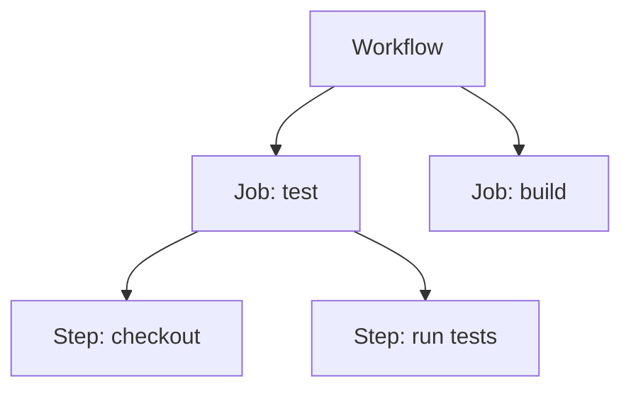

# Pipeline Anatomy

## Overview

A pipeline looks like one thing from the outside, but inside it has a clear structure. Understanding the parts, and how they nest, makes any workflow file readable.

---

## The parts, from largest to smallest

- **Workflow**: the whole pipeline, defined in one YAML file. It has a name and a trigger.
- **Job**: a unit of work that runs on its own fresh machine. A workflow can have several.
- **Step**: a single action inside a job, either a shell command or a prebuilt action.
- **Runner**: the machine a job runs on. Every job starts on a clean one.

---

## How jobs relate

By default, jobs run **in parallel**, each isolated on its own runner. To make one wait for another, you give it `needs`. A job with `needs: test` runs only after `test` succeeds, which is how you build a sequence like test, then build, then deploy.

Because each job is a separate machine, jobs do **not** share files. Anything one job produces for another must be passed deliberately, through an artifact or, as with images, through a registry.

---

## Steps: commands and actions

Within a job, steps run top to bottom, and a failed step stops the rest. A step is one of two kinds:

- A **command** (`run:`), which executes shell you write.
- An **action** (`uses:`), which runs a reusable, prebuilt unit such as `actions/checkout`.

---

## Putting it together

A typical workflow reads as: on some trigger, run these jobs, in this order, each doing these steps, on fresh machines. Once you see that shape, even a long workflow file becomes easy to follow.

---

## Next

- [Triggers and Events](triggers-and-events.md) covers what starts a workflow.
- [What is CI/CD?](../fundamentals/what-is-cicd.md) for the wider purpose.