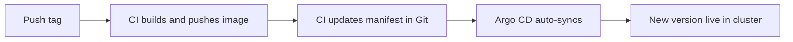

# Closing the Loop

You have all the pieces: CI publishes images, and Argo CD deploys from Git. But there is still a manual gap. When CI publishes a new image, something has to update the manifest so Argo CD knows about it. This lesson closes that gap, so a release flows all the way to the cluster on its own. 🔄

## What we will do (in very simple steps)

1. Turn on automatic syncing in Argo CD
2. Make CI update the manifest with the new image tag
3. Watch a release deploy itself to the cluster

---

## Step 1: Turn on auto-sync

Until now you clicked **Sync** by hand. Let's have Argo CD sync automatically whenever Git changes.

In the Argo CD dashboard, open the `snapshot` app, click **App Details**, then **Enable Auto-Sync**. From now on, any change to your `k8s/` folder is applied to the cluster without you clicking anything.

> 💡 The declarative equivalent is a `syncPolicy: automated` block in the Application manifest. Same behaviour, defined in Git.

---

## Step 2: Make CI update the manifest

When you release a new version, CI should write that version into `k8s/deployment.yaml` and commit it. Add this job to `.github/workflows/ci.yml`, after `build`:

```yaml
  update-manifest:
    needs: build
    runs-on: ubuntu-latest
    if: startsWith(github.ref, 'refs/tags/v')
    permissions:
      contents: write
    steps:
      - name: Check out main
        uses: actions/checkout@v4
        with:
          ref: main

      - name: Update the image tag
        run: |
          sed -i "s|snapshot-app:.*|snapshot-app:${{ github.ref_name }}|" k8s/deployment.yaml

      - name: Commit and push
        run: |
          git config user.name "github-actions"
          git config user.email "actions@github.com"
          git add k8s/deployment.yaml
          git commit -m "Deploy ${{ github.ref_name }} [skip ci]" || echo "no change"
          git push
```

What it does:

- Runs only on a version tag, after the image is built.
- `sed` rewrites the image line in the manifest to the new version.
- It commits that change back to `main`. The `[skip ci]` note stops this commit from triggering another pipeline run.
- `permissions: contents: write` lets the job push.

> This manifest update is the GitOps equivalent of the SSH deploy from the intermediate track. In a Kubernetes setup, changing Git **is** the deploy.

---

## Step 3: Watch the whole loop

Cut a release:

```bash
git tag v1.4.0
git push origin v1.4.0
```

Now watch it flow, hands-off, all the way through:



CI builds and publishes `v1.4.0`, updates the manifest, and pushes. Argo CD notices the change within moments, syncs, and rolls the cluster to the new image. You pushed one tag, and the new version is running in Kubernetes. 🎉 The loop is closed.

---

## ✅ Checkpoint

You are ready for the next lesson if:

- Auto-sync is enabled on the `snapshot` app
- Releasing a tag updates the image in `k8s/deployment.yaml` automatically
- Argo CD deploys the new version without you clicking anything

---

## 🩹 Common hiccups

- **The commit is not pushed**: the job needs `permissions: contents: write`, and must check out `main`, not the tag.
- **An endless run loop**: make sure the commit message contains `[skip ci]`, so the manifest commit does not start another pipeline.
- **Argo CD does not pick it up**: confirm auto-sync is on, and that it is watching the `main` branch and the `k8s` path.

---

**Next up:** [Drift and Self-Healing](drift-self-healing.md), where you change the cluster by hand and watch Argo CD put it back.