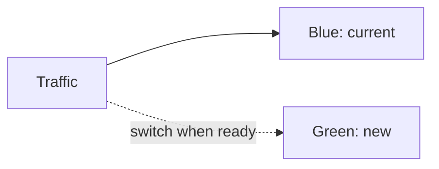
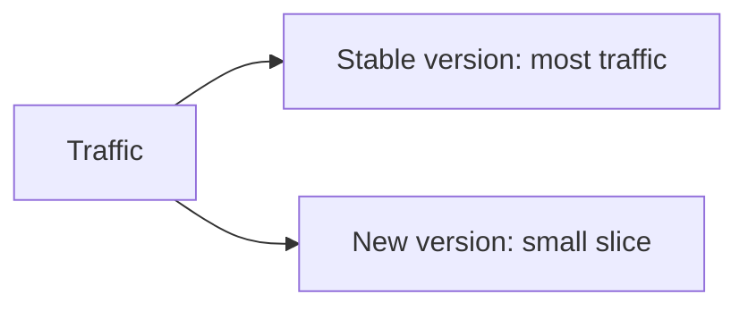

# Progressive Delivery

Your pipeline can now ship a new version to the whole cluster automatically. But swapping every user to a brand new version all at once is still a gamble: if it has a bug, everyone hits it. **Progressive delivery** reduces that risk by rolling out gradually and safely. This lesson introduces the two main strategies. 🐤

## What we will do (in very simple steps)

1. Understand blue-green deployment
2. Understand canary deployment
3. Read a canary rollout and explain it

---

## Blue-green deployment

Run **two** copies of your app: the current one (**blue**) and the new one (**green**). Deploy the new version to green while blue keeps serving everyone. Test green. When you are happy, switch all traffic over at once.



The big advantage is **instant rollback**: if green misbehaves, you switch traffic straight back to blue. The trade-off is cost, since you run two full copies during the change.

---

## Canary deployment

Named after the canary in a coal mine. Release the new version to a **small slice** of users first. Watch it. If it looks healthy, gradually send more traffic its way. If it looks bad, pull it back before most people ever saw it.



Canary is more gradual than blue-green, and cheaper, since you only run a few extra copies at a time.

---

## Exercise: read a canary rollout

Tools like **Argo Rollouts** (a companion to Argo CD) describe these strategies as manifests. Read this one and see if you can follow the plan:

```yaml
apiVersion: argoproj.io/v1alpha1
kind: Rollout
metadata:
  name: snapshot
spec:
  replicas: 4
  strategy:
    canary:
      steps:
        - setWeight: 25
        - pause: { duration: 2m }
        - setWeight: 50
        - pause: { duration: 2m }
        - setWeight: 100
```

In plain English, the `steps` describe the rollout:

1. Send **25%** of traffic to the new version.
2. **Wait 2 minutes** and observe.
3. Move to **50%**, wait again.
4. If all still looks good, go to **100%**.

During each pause, the rollout can be told to check health and **automatically roll back** if something looks wrong. The new version earns its way to full traffic, one careful step at a time.

---

## Where this fits

Progressive delivery sits on top of everything you have built. GitOps still deploys from Git, but instead of flipping straight to the new version, a rollout strategy eases it in. For most projects you will not need this on day one, but it is the natural next step once uptime really matters.

---

## ✅ Checkpoint

You are ready for the final challenge if you can answer:

- What is the main benefit of blue-green? *(Instant rollback by switching traffic.)*
- How does canary reduce risk? *(It exposes only a small slice of users at first.)*
- In the rollout above, what happens after the first `setWeight: 25`? *(It pauses for two minutes before increasing.)*

---

**Next up:** [Capstone: Full GitOps Loop](capstone.md), where you put the whole pipeline together, from a commit to a self-healing deployment.