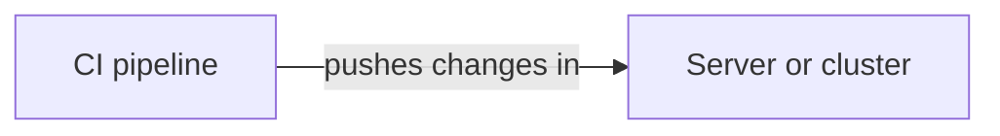
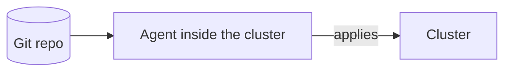

# Push vs Pull Delivery

There are two ways to get a change into a running system, and GitOps deliberately chooses the second. Understanding the difference explains why GitOps is set up the way it is. 🔀

## What we will do (in very simple steps)

1. Understand push delivery
2. Understand pull delivery
3. See why GitOps pulls

---

## Push delivery

This is what your pipeline does today. An outside system, the CI pipeline, reaches **into** the target and makes changes. It connects over SSH and runs commands.

For this to work, the pipeline must hold **credentials that let it change the target**. That is the key detail: something outside the cluster has the keys to the cluster.

---

## Pull delivery

GitOps works the other way. An **agent living inside the cluster** watches Git and **pulls** the desired state in. Nothing outside reaches in.

The direction of travel is reversed. The cluster reaches **out** to Git, rather than an external system reaching **in** to the cluster.

---

## Why GitOps pulls

That reversal brings real advantages:

- **Better security**: no outside system holds credentials to your cluster. If your CI system were ever compromised, it still could not touch the cluster directly. The agent only needs **read access to Git**.
- **Continuous, not one-shot**: a push happens once, at deploy time. A pulling agent runs **constantly**, so it also corrects drift and heals the cluster, not just deploys to it.
- **Git as the record**: because every change goes through Git, your history is a complete, auditable log of what changed and when.

---

## Push is not wrong

To be clear, push delivery is perfectly good, and the SSH pipeline you built is a solid, common approach for deploying to a server. Push is simpler to set up and fine for many situations.

GitOps and its pull model shine when you run **Kubernetes** and want self-healing, strong security boundaries, and Git as the source of truth. That is exactly where we are heading.

---

## ✅ Checkpoint

You are ready for the next lesson if you can answer:

- In push delivery, where do the cluster credentials live? *(In the external CI system.)*
- In pull delivery, what reaches out to what? *(The in-cluster agent reaches out to Git.)*
- Name one security benefit of pulling. *(No outside system holds cluster credentials.)*

---

**Next up:** [Snapshot on Kubernetes](kubernetes-manifests.md), where you write the manifests that describe the app as desired state.