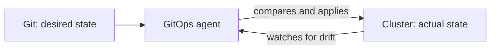

# What is GitOps?

Welcome to the Advanced track! 🚀

So far your pipeline **pushes** changes out: it connects to a server and runs commands to deploy. GitOps flips that idea around. Instead of pushing, you write down the **desired state** in Git, and an agent inside your cluster continuously makes reality match it. Git becomes the single source of truth for what should be running.

> ℹ️ This track builds on the **Kubernetes** course. It helps to be comfortable with Deployments and Services before going deep here.

## What we will do (in very simple steps)

1. Learn the three ideas behind GitOps
2. Understand the reconciliation loop
3. Read a Kubernetes manifest that describes Snapshot

---

## The three ideas behind GitOps

- **Declarative**: you describe *what* you want running, not the steps to get there. A file says "two copies of this image," not "run these commands."
- **Versioned in Git**: that description lives in a Git repository. Git is the single source of truth. Want to know what production should look like? Read the repo.
- **Continuously reconciled**: an agent constantly compares the cluster to Git and fixes any difference, automatically.

---

## The reconciliation loop

This is the heart of GitOps. An agent watches Git and the cluster, and works to keep them identical.



If Git changes, the agent updates the cluster to match. If someone changes the cluster by hand, the agent notices the difference (called **drift**) and puts it back. The cluster is always driven toward what Git says.

---

## Exercise: read a manifest

In Kubernetes, desired state is written as **manifests**. Here is one describing Snapshot. Read it and see if you can tell what it declares:

```yaml
apiVersion: apps/v1
kind: Deployment
metadata:
  name: snapshot
spec:
  replicas: 2
  selector:
    matchLabels:
      app: snapshot
  template:
    metadata:
      labels:
        app: snapshot
    spec:
      containers:
        - name: snapshot
          image: ghcr.io/your-username/snapshot-app:v1.3.0
          ports:
            - containerPort: 5000
---
apiVersion: v1
kind: Service
metadata:
  name: snapshot
spec:
  selector:
    app: snapshot
  ports:
    - port: 80
      targetPort: 5000
```

In plain English, this declares:

- A **Deployment** that should keep **two copies** of the `snapshot-app:v1.3.0` image running.
- A **Service** that routes traffic on port 80 to the app's port 5000.

Notice it never says *how*. There are no commands, no "pull then run." It only states the end result you want. GitOps takes a file like this, stored in Git, and makes the cluster match it.

---

## ✅ Checkpoint

You are ready for the next lesson if you can answer:

- What is the single source of truth in GitOps? *(Git.)*
- What does the agent do when the cluster drifts from Git? *(Corrects it back to match.)*
- Does a manifest describe the steps, or the desired result? *(The desired result.)*

---

## A note on the shift

This is a real change in mindset. Until now, deploying meant **running commands**. In GitOps, deploying means **changing a file in Git**, and letting the agent do the rest. The next lessons make that concrete.

---

**Next up:** [Push vs Pull Delivery](push-vs-pull.md), which explains why GitOps pulls, and why that matters.