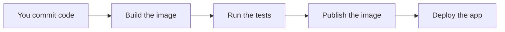

# Why Automate? (What CI/CD Actually Is)

Welcome to the CI/CD & GitOps course! 🎉

In the Docker course, every time you changed the code you did the same dance by hand: `docker build`, then `docker push`, then deploy. Fine once. Tedious and easy to get wrong the hundredth time. This course makes all of that happen on its own, every time you commit.

## What we will do (in very simple steps)

1. Understand the manual pain we are solving
2. Learn what CI and CD actually mean
3. Put the Snapshot app into a GitHub repository, ready to automate

---

## The manual pain

Think about what shipping a change looked like until now. For every single update you had to:

1. Build the image
2. Run any tests yourself (or forget to)
3. Push the image to a registry
4. Deploy it to wherever it runs

Do that ten times a day and it is dull. Do it in a hurry and you skip the tests, push the wrong tag, or forget a step. Every manual step is a chance to make a mistake. 😬

---

## What CI/CD means

CI/CD is two connected ideas:

- **CI, Continuous Integration**: every change you commit is automatically **built and tested**. If something breaks, you find out immediately, not days later.
- **CD, Continuous Delivery**: those tested changes are automatically **shipped onward**, to a server or a cluster, ready to run.

Put together, CI/CD is a system that turns a commit into a running application, with no manual steps in between.

---

## The mental model: a conveyor belt 🏭

Picture a factory conveyor belt. Code goes in one end, and a running app comes out the other. Along the way it passes through **stations**, each doing one job:



If any station fails, the belt stops and tells you exactly where. That belt is called a **pipeline**, and building it is what this whole course is about.

---

## What you'll build across this course

- **Beginner**: the belt builds, tests, and publishes your image on every commit.
- **Intermediate**: the belt deploys automatically to a server, with approvals and rollbacks.
- **Advanced**: the belt deploys to Kubernetes, using GitOps to keep the cluster in sync with your code.

We build it one station at a time, starting now by getting the app somewhere a pipeline can reach it: a GitHub repository.

---

## Exercise: put Snapshot into a GitHub repository

A pipeline needs your code in a Git repository it can watch. Let's create one.

### Step 1: Create the project

Make a fresh folder for the app and add three files.

```bash
mkdir ~/snapshot-app
cd ~/snapshot-app
```

`app.py`:

```python
from flask import Flask

app = Flask(__name__)

@app.route("/")
def home():
    return {"message": "Hello from Snapshot!"}

if __name__ == "__main__":
    app.run(host="0.0.0.0", port=5000)
```

`requirements.txt`:

```
flask
```

`Dockerfile`:

```dockerfile
FROM python:3.12-slim
WORKDIR /app
COPY requirements.txt .
RUN pip install --no-cache-dir -r requirements.txt
COPY . .
EXPOSE 5000
CMD ["python", "app.py"]
```

### Step 2: Turn it into a Git repository

```bash
git init
git add .
git commit -m "Initial Snapshot app"
```

### Step 3: Create a repository on GitHub

Go to [github.com/new](https://github.com/new), name the repository `snapshot-app`, leave it public, and **do not** add a README (you already have files). Create it.

### Step 4: Push your code

GitHub will show you commands. Use the "push an existing repository" ones, which look like this (with your username):

```bash
git remote add origin https://github.com/YOUR_USERNAME/snapshot-app.git
git branch -M main
git push -u origin main
```

Refresh the GitHub page and your files will be there. 🎉

---

## ✅ Checkpoint

You are ready for the next lesson if:

- You can explain the difference between CI and CD in one sentence each
- Your `snapshot-app` folder has `app.py`, `requirements.txt`, and a `Dockerfile`
- The repository appears on GitHub with all three files

---

## 🩹 Common hiccups

- **`git: command not found`**: install Git first, then retry. On Ubuntu: `sudo apt install -y git`.
- **Push asks for a password and rejects it**: use a personal access token or the GitHub CLI, the same way you set up pushing in the Docker course.
- **"remote origin already exists"**: you ran the remote command twice. Fix it with `git remote set-url origin https://github.com/YOUR_USERNAME/snapshot-app.git`.

---

**Next up:** [Meet GitHub Actions](github-actions-intro.md), where you build the first station on the conveyor belt.