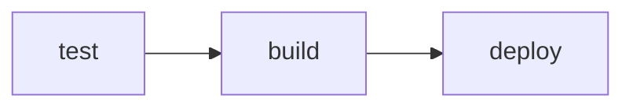

# Deploy to a Server

This is the moment the pipeline stops just publishing an image and starts **deploying** it. When you cut a release, the pipeline will connect to a real server and put the new version live, with no manual steps. It automates the deploy you did by hand in the Docker course. 🚀

> ℹ️ **You can read this without a server.** The deployment steps need a VM, which costs a little. Follow along if you have one, or read through to understand how automated deployment works and return when you are ready.

## What we will do (in very simple steps)

1. Add the server credentials as secrets
2. Add a `deploy` job that connects over SSH
3. Cut a release and watch it deploy itself

---

## Prerequisites

- A server with Docker installed (the same kind you set up in the Docker course's deploy lesson)
- The image package set to **public**, so the server can pull it (on GitHub, open the package under Packages, then Package settings, and change visibility to public)

---

## Step 1: Create a deploy key and add the secrets

Your pipeline needs to log in to the server without a password, using an SSH key.

On your machine, create a key pair just for deployment:

```bash
ssh-keygen -t ed25519 -f snapshot-deploy-key -N ""
```

That makes two files: `snapshot-deploy-key` (private) and `snapshot-deploy-key.pub` (public).

- Add the **public** key to your server, by appending the contents of `snapshot-deploy-key.pub` to `~/.ssh/authorized_keys` on the server.
- Add three **secrets** to your repository (Settings, then Secrets and variables, then Actions), just like the last lesson:
  - `SSH_HOST`: your server's IP address
  - `SSH_USER`: the login name on the server
  - `SSH_PRIVATE_KEY`: the full contents of the **private** `snapshot-deploy-key` file

---

## Step 2: Add the deploy job

Open `.github/workflows/ci.yml` and add this third job, after the `build` job:

```yaml
  deploy:
    needs: build
    runs-on: ubuntu-latest
    if: startsWith(github.ref, 'refs/tags/v')
    steps:
      - name: Deploy over SSH
        uses: appleboy/ssh-action@v1
        with:
          host: ${{ secrets.SSH_HOST }}
          username: ${{ secrets.SSH_USER }}
          key: ${{ secrets.SSH_PRIVATE_KEY }}
          script: |
            docker pull ghcr.io/${{ github.repository }}:${{ github.ref_name }}
            docker rm -f snapshot || true
            docker run -d --name snapshot -p 80:5000 ghcr.io/${{ github.repository }}:${{ github.ref_name }}
```

Reading it:

- `needs: build` runs deploy only after the image is built and published.
- `if: startsWith(github.ref, 'refs/tags/v')` means deploy runs **only on version tags**, not on every push. Ordinary work still tests and builds, but only a release actually goes live.
- The `appleboy/ssh-action` connects using your secrets and runs the script **on the server**: pull the new image, remove the old container, start the new one.

Your pipeline is now three stages:



---

## Step 3: Release and watch it deploy

Commit the workflow, then cut a release:

```bash
git add .
git commit -m "Add automated deployment"
git push
git tag v1.1.0
git push origin v1.1.0
```

In the **Actions** tab, the tag triggers all three jobs in sequence. When `deploy` goes green, visit your server's address in a browser. The new version is live, deployed entirely by the pipeline. 🎉

From now on, shipping a release is just pushing a tag.

---

## ✅ Checkpoint

You are ready for the next lesson if:

- The three secrets are set, and the deploy key works
- The `deploy` job runs only on version tags, after `build`
- Pushing a version tag deployed the app to your server

---

## 🩹 Common hiccups

- **SSH connection fails**: the public key must be in the server's `authorized_keys`, and `SSH_PRIVATE_KEY` must contain the whole private key, including its first and last lines.
- **"pull access denied" on the server**: the image package is still private. Set it to public, or log in to the registry on the server.
- **"invalid reference format"**: `ghcr.io` needs lowercase names. If your username has capitals, that is the cause.
- **`deploy` was skipped**: it only runs on version tags. A plain push will not trigger it, by design.

---

**Next up:** [Environments and Gates](environments-gates.md), where you add staging and production, with a manual approval before anything reaches production.