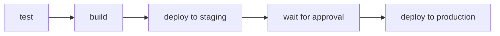

# Environments and Gates

Deploying straight to production on every release is risky. Real teams deploy to a **staging** environment first, check it, then **promote** to production, often with a human giving the final approval. This lesson adds that safety rail. 🚦

## What we will do (in very simple steps)

1. Create staging and production environments
2. Require a manual approval before production
3. Split the deploy into a staging step and a production step

---

## What an environment is

A GitHub **environment** is a named deployment target, like `staging` or `production`. Each one can have:

- Its **own secrets** (so staging and production can point at different servers)
- **Protection rules**, such as requiring a person to approve before a deploy runs

When a job is tied to a protected environment, GitHub **pauses** the pipeline and waits for approval before letting that job run. That pause is your gate.

> ℹ️ Environment approvals are free on **public** repositories, which yours is.

---

## Step 1: Create the environments

On GitHub, in your repository: **Settings**, then **Environments**.

1. **New environment**, name it `staging`. Add its secrets (`SSH_HOST`, `SSH_USER`, `SSH_PRIVATE_KEY`) for your staging server.
2. **New environment**, name it `production`. Add its secrets too. Then, under **Protection rules**, tick **Required reviewers** and add yourself.

> 💡 Only have one server? Point both environments at it for practice. The lesson's real goal is the approval flow, not two machines.

Because secrets now live inside environments, each job picks up the secrets of the environment it targets, using the same `${{ secrets.SSH_HOST }}` reference.

---

## Step 2: Split the deploy

Replace your single `deploy` job with these two jobs:

```yaml
  deploy-staging:
    needs: build
    runs-on: ubuntu-latest
    if: startsWith(github.ref, 'refs/tags/v')
    environment: staging
    steps:
      - name: Deploy to staging
        uses: appleboy/ssh-action@v1
        with:
          host: ${{ secrets.SSH_HOST }}
          username: ${{ secrets.SSH_USER }}
          key: ${{ secrets.SSH_PRIVATE_KEY }}
          script: |
            docker pull ghcr.io/${{ github.repository }}:${{ github.ref_name }}
            docker rm -f snapshot || true
            docker run -d --name snapshot -p 80:5000 ghcr.io/${{ github.repository }}:${{ github.ref_name }}

  deploy-production:
    needs: deploy-staging
    runs-on: ubuntu-latest
    environment: production
    steps:
      - name: Deploy to production
        uses: appleboy/ssh-action@v1
        with:
          host: ${{ secrets.SSH_HOST }}
          username: ${{ secrets.SSH_USER }}
          key: ${{ secrets.SSH_PRIVATE_KEY }}
          script: |
            docker pull ghcr.io/${{ github.repository }}:${{ github.ref_name }}
            docker rm -f snapshot || true
            docker run -d --name snapshot -p 80:5000 ghcr.io/${{ github.repository }}:${{ github.ref_name }}
```

The pieces that matter:

- Each job names its `environment`, so it uses that environment's secrets.
- `deploy-production` has `needs: deploy-staging`, so production only happens after staging.
- Because `production` has a required reviewer, that job **waits for your approval** before running.



---

## Step 3: Release and approve

Push a new release tag:

```bash
git add .
git commit -m "Add staging and production environments"
git push
git tag v1.2.0
git push origin v1.2.0
```

In the **Actions** tab, watch `deploy-staging` run automatically. Then `deploy-production` appears with a **Review deployments** button. Nothing goes to production until you click it and approve. Approve it, and production deploys. 🎉

You now have a real promotion flow with a human gate.

---

## ✅ Checkpoint

You are ready for the next lesson if:

- You created `staging` and `production` environments
- `production` requires a reviewer
- A release deploys to staging automatically, then waits for your approval before production

---

## 🩹 Common hiccups

- **Production ran without asking**: the required reviewer rule is not set on the `production` environment. Check its protection rules.
- **"environment not found"**: the `environment:` name in the workflow must match the environment name exactly.
- **Secrets not found in a job**: the secrets must be added **inside** that environment, not only at repository level.

---

**Next up:** [Faster Pipelines](caching.md), where you speed things up by caching dependencies between runs.