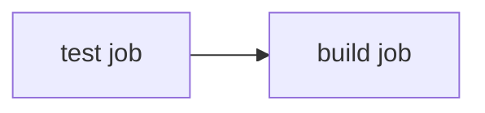

# Multi-Stage Pipelines

Right now everything happens in one job: test, build, and publish as a single list of steps. As pipelines grow, it helps to split the work into separate **jobs** that chain together, each with a clear purpose. This lesson does that, and sets up the deploy stages to come. 🔗

## What we will do (in very simple steps)

1. Learn how jobs relate to each other
2. Split the pipeline into a `test` job and a `build` job
3. Chain them so `build` only runs if `test` passes

---

## Jobs run in parallel by default

An important fact: separate jobs run **at the same time**, each on its own fresh machine. That is great for speed, but sometimes you need order. You do not want to build and publish an image before the tests have passed.

The keyword `needs` creates that order. A job with `needs: test` waits for the `test` job and runs **only if it succeeded**.



---

## One catch: jobs do not share files

Because each job runs on its own machine, they do not share a filesystem. A job cannot see files another job created. Each job that needs your code checks it out again. This is why the image is shared through the **registry** (the build job pushes it) rather than handed directly between jobs.

---

## Step 1: Split the workflow

Open `.github/workflows/ci.yml` and replace its contents with this two-job version:

```yaml
name: CI

on:
  push:
    branches:
      - main
    tags:
      - 'v*'

jobs:
  test:
    runs-on: ubuntu-latest
    steps:
      - name: Check out the code
        uses: actions/checkout@v4

      - name: Set up Python
        uses: actions/setup-python@v5
        with:
          python-version: "3.12"

      - name: Install dependencies
        run: pip install -r requirements.txt pytest

      - name: Run tests
        run: pytest

  build:
    needs: test
    runs-on: ubuntu-latest
    permissions:
      contents: read
      packages: write
    steps:
      - name: Check out the code
        uses: actions/checkout@v4

      - name: Log in to the registry
        uses: docker/login-action@v3
        with:
          registry: ghcr.io
          username: ${{ github.actor }}
          password: ${{ secrets.GITHUB_TOKEN }}

      - name: Build and push the image
        run: |
          docker build -t ghcr.io/${{ github.repository }}:${{ github.ref_name }} .
          docker push ghcr.io/${{ github.repository }}:${{ github.ref_name }}
```

The important line is `needs: test` on the `build` job. It makes `build` wait for `test`, and skip entirely if `test` fails.

---

## Step 2: Push and watch the graph

```bash
git add .
git commit -m "Split pipeline into test and build jobs"
git push
```

In the **Actions** tab, open the run. Instead of one job, you now see a small **graph**: `test`, with `build` connected after it. `build` sits waiting until `test` goes green, then starts.

---

## Step 3: See the gate work

Break a test on purpose (change the expected message in `test_app.py`), push, and watch: `test` goes red, and `build` shows as **skipped**. It never ran, because its `needs` was not satisfied. Fix the test and push again to go back to green.

---

## ✅ Checkpoint

You are ready for the next lesson if:

- Your workflow has separate `test` and `build` jobs
- The `build` job has `needs: test`
- The Actions graph shows `build` running after `test`, and skipping when `test` fails

---

## 🩹 Common hiccups

- **`build` cannot find your files**: each job needs its own `checkout` step. Make sure `build` checks out the code too.
- **`build` runs even when tests fail**: check that `needs: test` is on the `build` job, spelled exactly.
- **"job depends on unknown job"**: the name in `needs` must match a real job name exactly. Here it is `test`.

---

**Next up:** [Deploy to a Server](deploy-to-server.md), where you add a `deploy` job that runs after `build` and ships the app to a real machine.