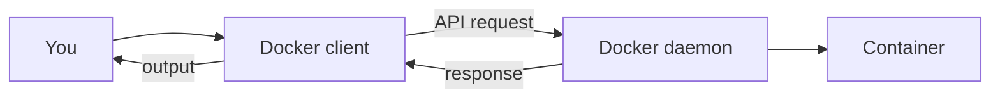

# Client vs Daemon

## Overview

The `docker` command you type is only a **messenger**. The real work happens in a separate background service. This split, a lightweight client talking to a powerful daemon, is central to how Docker works, and it explains several behaviours that otherwise seem odd.

---

## The client

The **Docker client** is the `docker` command line tool. Its whole job is to take what you type, turn it into a request, send it to the daemon, and show you the reply. It does no container work of its own. If the daemon is not running, the client can do nothing.

## The daemon

The **Docker daemon** (`dockerd`) receives those requests and carries them out: building images, running containers, managing networks and volumes. It runs continuously in the background, and it runs with high privileges, effectively as the system administrator, because creating containers needs deep access to the operating system.

---

## How they communicate

The client and daemon talk over the Docker API, usually through a local connection called a socket.

You type a command, the client sends a request, the daemon does the work, and the result travels back to your screen.

---

## Why the split matters

This separation is not just tidy design. It has real consequences:

- **Remote control**: because they communicate over an API, a client on one machine can control a daemon on another.
- **Mac and Windows**: containers need a Linux kernel, so on these systems the daemon runs inside a small hidden Linux virtual machine while the client runs natively. This is why Docker Desktop must be running before any command works.
- **Security**: since the daemon runs with administrator rights, access to it is effectively administrator access to the machine, which is why it is carefully protected.

---

## Next

- [Docker Architecture Overview](docker-architecture.md) for how this fits the wider picture.
- [Docker Engine](docker-engine.md) for what the daemon is built from.