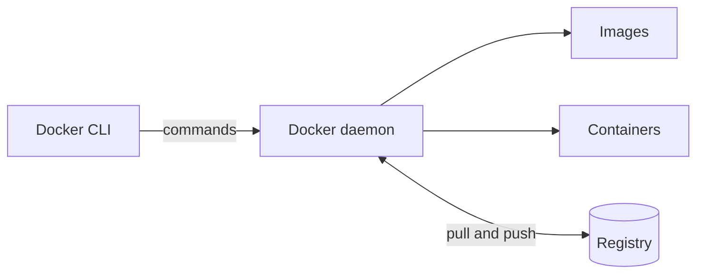

# Docker Architecture Overview

## Overview

Docker is built on a **client-server model**. When you type a Docker command, a small client program hands it to a background service, and that service does the real work of building and running containers. Knowing the main parts makes Docker's behaviour far easier to reason about.

---

## The main parts

- **Docker client**: the `docker` command you type in your terminal. It sends instructions and shows you results, but does no container work itself.
- **Docker daemon**: the background service (named `dockerd`) that actually builds images, runs containers, and manages networks and volumes.
- **Images**: read-only templates that an application is packaged into.
- **Containers**: running instances created from images.
- **Registry**: a remote store of images, such as Docker Hub, that the daemon pulls from and pushes to.

---

## What happens when you run a container

Following a single command, `docker run nginx`, shows how the parts cooperate:

1. The **client** turns your command into a request and sends it to the daemon.
2. The **daemon** looks for the nginx image on your machine.
3. If it is missing, the daemon **pulls** it from the registry.
4. The daemon **creates** a container from that image.
5. The daemon **starts** the container, and its output streams back through the client to your screen.

You typed one line, but five distinct steps happened behind it. Every Docker command follows this same shape: client asks, daemon acts.

---

## Next

- [Docker Engine](docker-engine.md) looks inside the daemon itself.
- [Client vs Daemon](client-daemon.md) explains how the two halves communicate.