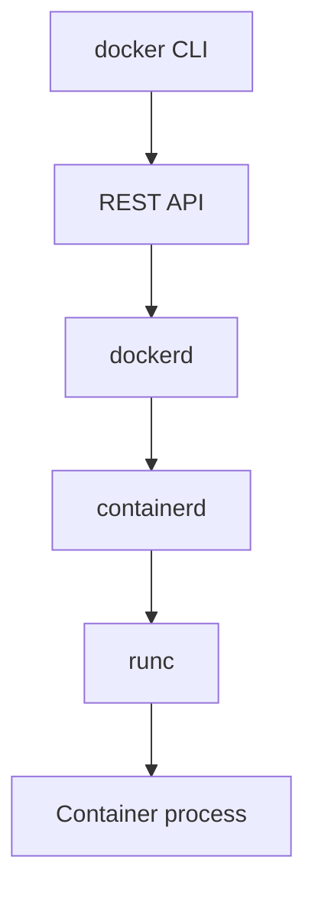

# Docker Engine

## Overview

The **Docker Engine** is the core software that runs and manages containers. When someone says "Docker is installed and running," they mean the engine is active. It is made of three parts working together: a command line tool, an API, and a background daemon.

---

## The three parts

- **The CLI** (`docker`): the command line tool you type into. It is the front door.
- **The REST API**: the interface the CLI uses to talk to the daemon. Because it is a standard API, other programs and tools can drive Docker too, not just the CLI.
- **The daemon** (`dockerd`): the long-running background process that does the actual work of managing images, containers, networks, and volumes.

---

## Under the hood

The daemon does not create containers entirely by itself. It hands the low-level work down through smaller, specialised components:

- **containerd** manages the container lifecycle: pulling images, and starting and stopping containers.
- **runc** is the small tool that actually creates a container by asking the Linux kernel for the namespaces and control groups that isolate it.

This layered design follows shared industry standards (the Open Container Initiative), which is why images and runtimes built for Docker also work with other container tools. Docker is not a single monolithic program, but a stack of cooperating pieces.

---

## Next

- [Client vs Daemon](client-daemon.md) explains the split between what you type and what runs it.
- [Image Layers](../images/image-layers.md) looks at how the images the engine runs are structured.