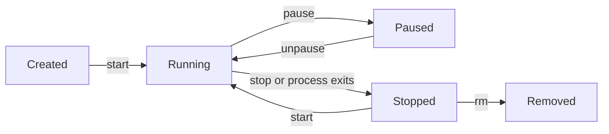

# Container Lifecycle

## Overview

A container moves through a small set of well-defined states during its life. The beginner tutorial showed the commands that move it between them. This page explains the **states themselves**, and what is really happening at each one.

---

## The states

- **Created**: the container exists, with its filesystem and configuration ready, but nothing is running yet. `docker run` normally creates and starts in a single step, so you rarely see this state on its own.
- **Running**: the container's main process is executing. This is the normal, active state.
- **Paused**: the running processes are frozen in place. They use no CPU but stay in memory, ready to resume exactly where they left off.
- **Stopped** (also shown as *Exited*): the main process has ended, either because it finished or because you stopped it. The container still exists, with its writable layer and configuration intact, but nothing is running. It can be started again.
- **Removed**: the container and its writable layer are deleted. It is gone.

(`docker run` is really "create then start" combined.)

---

## A container is just a process

The mental model that ties this together: a running container **is** its main process running. Nothing more mystical than that.

This explains behaviour you have already seen. The `hello-world` container printed its message and stopped instantly, because its main process finished immediately. An nginx container keeps running because its process stays alive waiting for requests. A container lives exactly as long as its main process does.

---

## What survives each transition

- **Stop then start**: the writable layer survives, so the container's data is intact when it resumes.
- **Remove**: the writable layer is destroyed along with the container.

This is the mechanism behind the volumes lesson: to keep data beyond a container's removal, it must live outside that writable layer.

---

## Next

- [Isolation and Namespaces](isolation.md) explains what keeps containers separate.
- [Data Persistence](../storage/data-persistence.md) explains how to keep data for good.