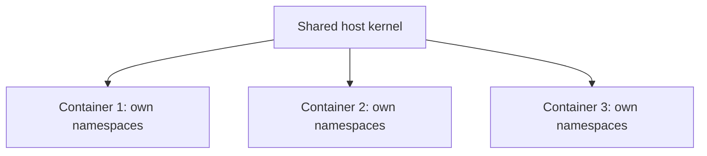

# Isolation & Namespaces

## Overview

Containers feel separate. Each one has its own files, its own processes, and its own network, apparently unaware of the others. That separation is not magic. It comes from two long-standing features of the Linux kernel: **namespaces** and **control groups**.

---

## Namespaces: a private view

A **namespace** gives a process its own private view of one part of the system. The process sees only what is inside its namespace, as if the rest of the machine did not exist. Docker uses several at once:

- **PID namespace**: its own list of processes, so a container cannot see or affect processes on the host.
- **Network namespace**: its own network interfaces, IP address, and ports.
- **Mount namespace**: its own filesystem view.
- **UTS namespace**: its own hostname.
- **IPC namespace**: its own channel for processes to talk to one another.
- **User namespace**: it can map users inside the container to different users on the host.

Stacked together, these make a container believe it has the whole machine to itself.

---

## Control groups: limited resources

Namespaces control what a container can **see**. **Control groups** (cgroups) control what it can **use**. They limit and account for resources such as CPU and memory, so that one container cannot consume everything and starve the others. When you set a memory or CPU limit on a container, cgroups are what enforce it.

---

## Isolation is strong, but not a full boundary

Notice what the diagram shows: every container shares the host's **single kernel**. That makes containers wonderfully lightweight, but it also means the isolation, while strong, is not as absolute as a virtual machine's. In principle, a flaw in the shared kernel could let a container escape its boundary.

For the vast majority of workloads this is perfectly safe. When you need the hardest possible separation, for example between untrusted tenants, that is where virtual machines still earn their place, often by running the containers inside them.

---

## Next

- [Containers vs Virtual Machines](../fundamentals/containers-vs-vm.md) compares the two isolation models.
- [Docker Networking Overview](../networking/networking.md) builds on the network namespace idea.