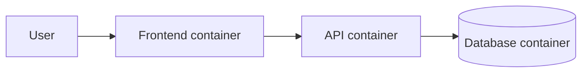

# Multi-Container Architecture

## Overview

Real applications are rarely a single container. They are built from several **single-purpose** containers working together. This page explains why that is the norm, and how the pieces relate.

---

## One concern per container

The guiding principle is simple: **each container should do one job**. A frontend, an API, a database, and a background worker each live in their own container rather than being bundled together.

Keeping them separate keeps them independent. You can update, restart, or scale one without disturbing the others, and you can swap one out (a different database, say) without touching the rest.

---

## How the pieces relate

Compose gives you three tools to connect single-purpose containers into a system:

- **Services**: each container is defined as a service.
- **A shared network**: Compose places the services on one network so they discover each other by name.
- **Dependencies**: `depends_on` expresses the order they should start in.

---

## The Snapshot example

The final tutorial built exactly this shape. The **frontend** serves the page and forwards API requests to the **API**, which reads and writes the **database**. Only the frontend is exposed to the outside world; the API and database stay private inside the stack. Each tier is replaceable on its own.

---

## Why build this way

- **Independent scaling**: run several API containers behind one database if traffic demands it.
- **Independent updates**: ship a new frontend without restarting the database.
- **Separation of concerns**: each part stays small and focused.
- **Reusability**: standard images (like Postgres) drop in without modification.

This same thinking, many small containers cooperating, is exactly what Kubernetes is built to manage at large scale.

---

## Next

- [What is Docker Compose?](docker-compose.md) for the tool that runs these systems.
- The [Full Stack App with Compose](../../tutorials/end-to-end/fullstack-compose.md) tutorial builds one end to end.