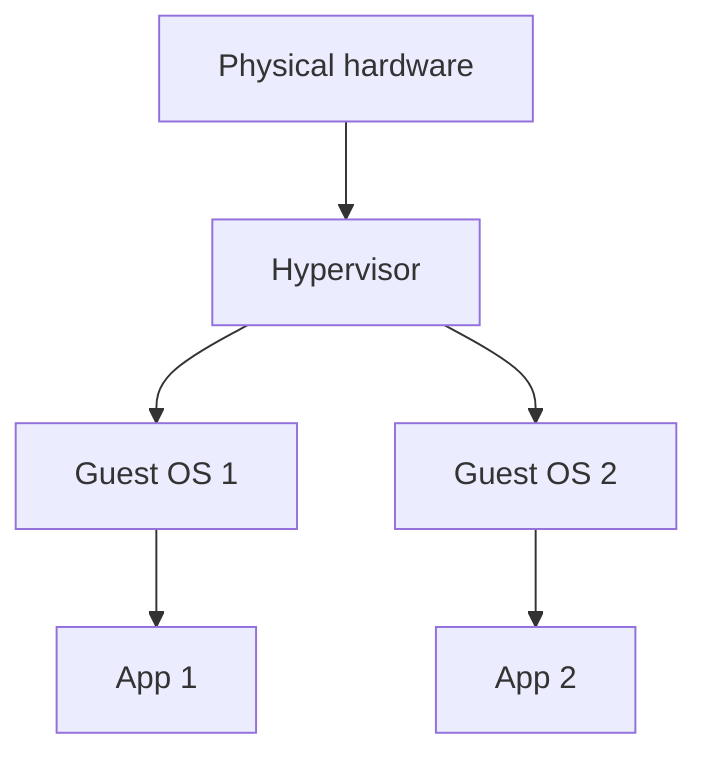
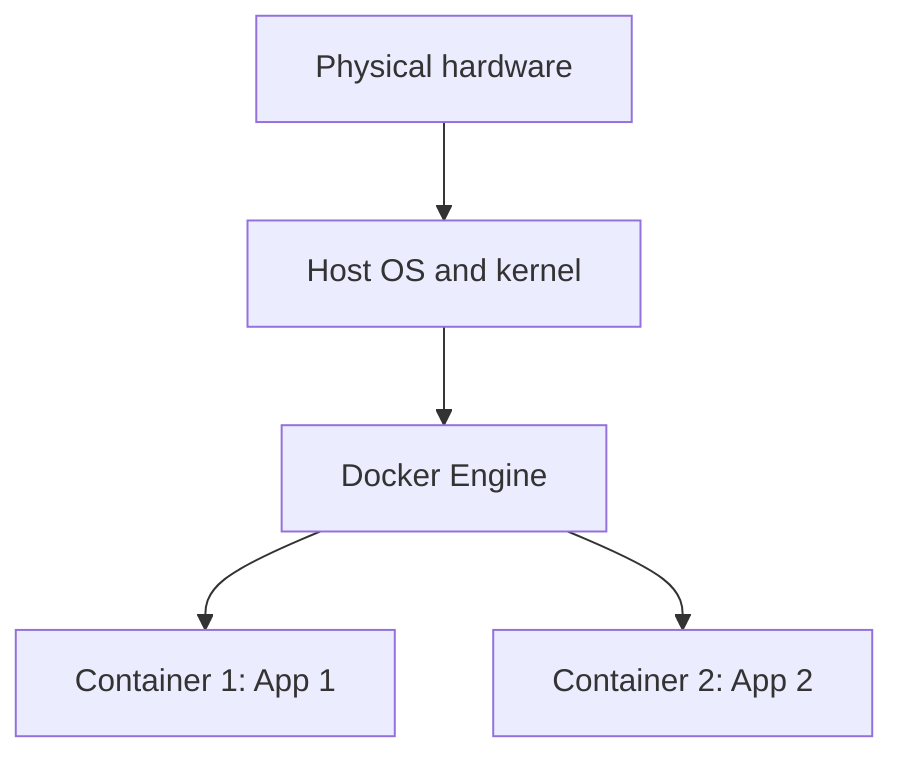

# Containers vs Virtual Machines

## Overview

Containers and virtual machines both let you run isolated workloads on one physical machine, but they work very differently. Understanding the difference explains why containers are so small and fast, and why virtual machines still exist.

---

## How a virtual machine works

A virtual machine (VM) uses a piece of software called a **hypervisor** to pretend that one physical computer is several separate ones. Each VM contains a **complete guest operating system**, its own kernel included, running on top of that virtual hardware.

Because every VM boots a full operating system, it is heavy: often gigabytes in size and tens of seconds to start.

---

## How a container works

A container does not include an operating system. Every container on a machine **shares the host's single kernel**, and is isolated using namespaces and control groups. Docker's engine manages them.

Because there is no guest operating system to boot, a container is typically megabytes in size and starts in milliseconds.

---

## Side by side

| | Virtual Machine | Container |
|---|---|---|
| Includes a full OS | Yes, a guest OS per VM | No, shares the host kernel |
| Typical size | Gigabytes | Megabytes |
| Startup time | Seconds to minutes | Milliseconds |
| How many per host | A handful | Dozens or hundreds |
| Isolation strength | Very strong | Strong, but shares the kernel |

---

## When to use which

Reach for **containers** when you want to package and run applications efficiently, run many services on one machine, or keep development and production identical. This covers the majority of modern web and backend work.

Reach for **virtual machines** when you need to run a different operating system entirely, or when you need the strongest possible isolation between workloads, for example separating untrusted tenants.

In practice the two are often combined: containers frequently run *inside* virtual machines in the cloud, getting the efficiency of containers and the hard isolation of VMs at the same time.

---

## Next

- [What is Docker?](what-is-docker.md) for the bigger picture.
- [Isolation and Namespaces](../containers/isolation.md) for how container separation works in detail.