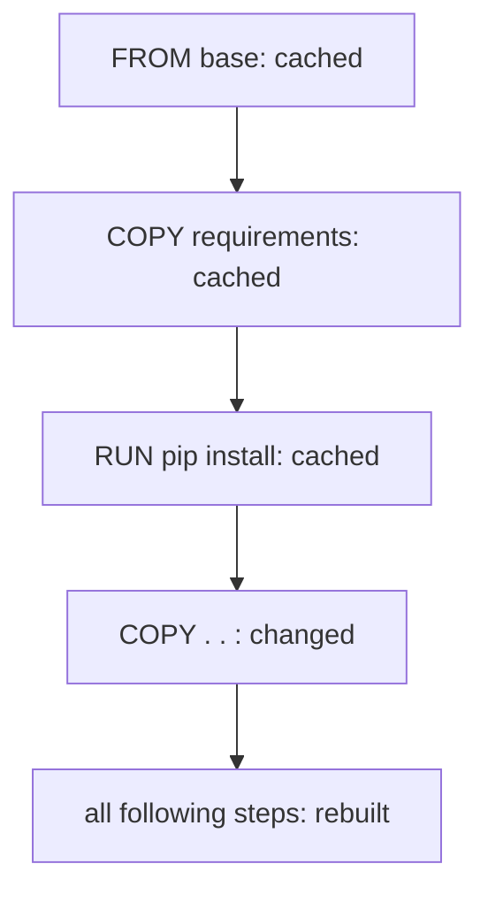

# Image Caching

## Overview

Docker caches every layer as it builds. If nothing that affects a layer has changed since last time, Docker reuses the stored layer instead of doing the work again. This is why the first build of an image is slow, and the next one is often nearly instant.

---

## How the cache decides

Docker works through the Dockerfile top to bottom. For each instruction it asks: has this instruction, or the files it depends on, changed since the last build?

- **No change**: a cache hit. Docker reuses the existing layer.
- **Change**: a cache miss. Docker rebuilds that layer from scratch.

---

## Invalidation cascades

Here is the rule that matters most: once one layer is rebuilt, **every layer after it is rebuilt too**, even if those later instructions did not change. The cache is only trusted up to the first change.

A change partway down the Dockerfile invalidates everything below it.

---

## Why instruction order matters

This cascade is the reason the build tutorial copied `requirements.txt` and installed dependencies **before** copying the application code:

- Dependencies change **rarely**, so their expensive install layer stays cached.
- Code changes **constantly**, so it goes last, where a change only rebuilds the quick final copy.

Reverse that order, and every tiny code edit would throw away the cache and reinstall every dependency from scratch.

---

## Practical takeaways

- Copy dependency files and install them before copying the rest of your code.
- Put the instructions that change most often near the end.
- Use a `.dockerignore` so unrelated file changes do not needlessly invalidate the cache.

---

## Next

- [Image Layers](image-layers.md) for the structure the cache is built on.
- The [Optimize Image Size](../../tutorials/advanced/optimize-images.md) tutorial puts these ideas into practice.