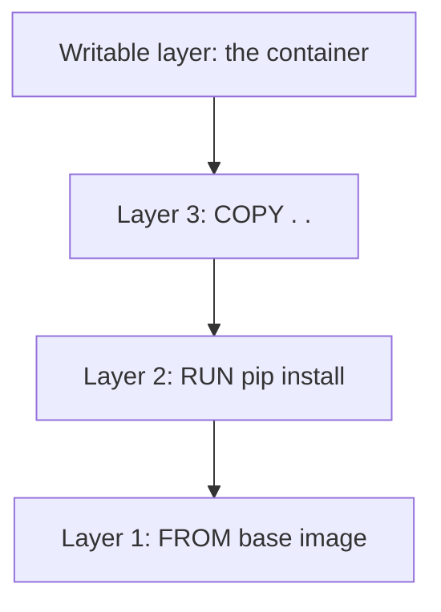

# Image Layers

## Overview

An image is not one solid block. It is a **stack of read-only layers**, each built on top of the one below. Understanding layers explains how Docker saves space, why some builds are fast, and where a container's changes actually go.

---

## How layers are created

Each instruction in a Dockerfile adds a **new layer** on top of the previous one. A layer simply records the filesystem changes that its instruction made.

The base image sits at the bottom, and your instructions stack upward. Together, the read-only layers form the complete filesystem the application sees.

---

## Layers are shared

Layers are stored once and **reused across images**. If ten images all start `FROM python:3.12-slim`, that base layer is stored a single time on your machine and shared by all of them. The same is true when pulling: Docker only downloads layers it does not already have. This is why the second image using a familiar base pulls almost instantly.

---

## The writable layer

The image layers are read-only. So where do a container's changes go? When you start a container, Docker adds a thin **writable layer** on top of the stack. Everything the container writes lives there.

This is the mechanism behind the beginner lesson where changes vanished. Remove the container and its writable layer is deleted with it, while the read-only image layers underneath are never touched. It also means many containers can run from one image, each with its own private writable layer, without interfering with each other.

---

## Next

- [Image Caching](image-caching.md) explains how layers make rebuilds fast.
- [Data Persistence](../storage/data-persistence.md) explains how to keep data beyond that writable layer.