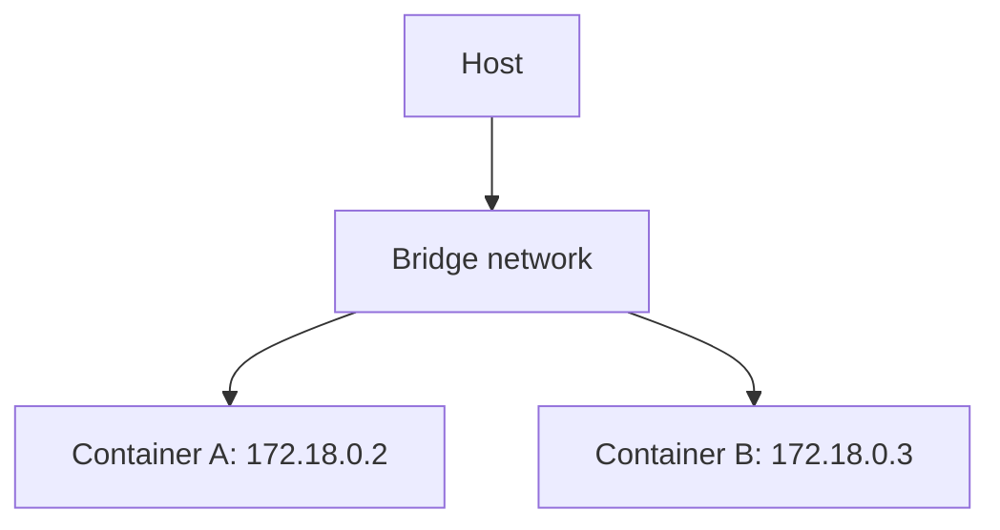

# Bridge Network

## Overview

The **bridge** is Docker's default network type. It creates a private virtual network on your machine that containers attach to. A useful way to picture it is a **virtual switch**: containers plug into it, and it passes traffic between them.

---

## Default bridge vs user-defined bridge

There are two flavours, and the difference matters:

- **The default bridge** (named `bridge`): every container joins it automatically unless told otherwise. But containers on it can only reach each other by **IP address**, not by name. That makes it awkward to use.
- **A user-defined bridge** (one you make with `docker network create`): this adds automatic **name-based discovery**, so containers reach each other by their names. This is the recommended approach, and it is exactly what Docker Compose creates for you behind the scenes.

---

## How it works

Each container attached to the bridge is given a private IP address on the bridge's subnet. The bridge routes traffic between containers, and connects them outward to the host and the internet using address translation (NAT).

---

## Why user-defined bridges are preferred

- **Name-based discovery**: no need to look up and hard-code IP addresses.
- **Cleaner isolation**: only the containers you attach can talk to each other.

This is also what the networking tutorial's "break it on purpose" step demonstrated. When the app was left on the default bridge instead of the shared user-defined network, it could not resolve the database by name, and the connection failed.

---

## Next

- [Host Network](host-network.md) for a very different approach.
- [Docker Networking Overview](networking.md) for the wider picture.