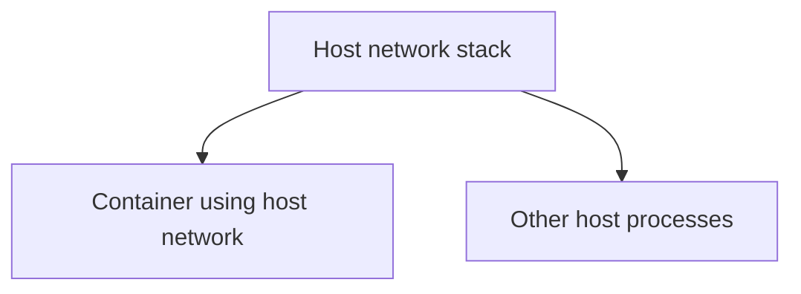

# Host Network

## Overview

Host networking removes the separation entirely. With `--network host`, a container does **not** get its own network namespace. Instead it shares the host's network stack directly, as if the application were running on the host itself.

---

## What that means in practice

- **No separate container IP**: the container uses the host's own address.
- **No port publishing**: if the app listens on port 8080, it is immediately on the host's port 8080. There is no `-p` mapping, because there is no boundary to map across.
- **Slightly faster**: with no virtual network layer or address translation in between, there is a little less overhead.

---

## The trade-offs

Host networking gives up the very isolation that makes containers safe and tidy:

- **No network isolation** between the container and the host.
- **Port conflicts**: two containers cannot both use the same host port, because they share one set of ports.
- **Platform differences**: it is primarily a Linux feature. On Docker Desktop for Mac and Windows, containers run inside a virtual machine, so host networking behaves differently and is often not what you expect.

---

## When to use it

Reach for host networking only for specific needs: performance-sensitive workloads that cannot afford the small networking overhead, or tools that genuinely need to see the host's network interfaces directly.

For almost everything else, a **user-defined bridge** is the better default. It keeps containers isolated, avoids port clashes, and gives you clean name-based discovery.

---

## Next

- [Bridge Network](bridge-network.md) for the recommended default.
- [Docker Networking Overview](networking.md) for how the types compare.