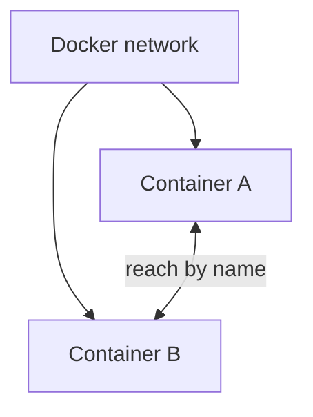

# Docker Networking Overview

## Overview

Because of the network namespace, every container starts with its own private network: its own interfaces, its own address, its own ports. Docker networking is about **connecting** those private networks, both to each other and to the outside world.

---

## Containers on a network

When containers share a Docker network, they can reach one another. On a **user-defined network**, Docker also runs a small DNS service, so containers find each other by **name** rather than by chasing IP addresses. This is why the networking tutorial could point the app at a database simply by its container name.

---

## Reaching the outside: publishing ports

A container's ports are **private by default**. Other containers on the same network can reach them, but your laptop and the wider internet cannot.

Publishing a port with `-p HOST:CONTAINER` opens a door from the host into the container. That is the difference between a database (usually left unpublished, reachable only by the app) and a web frontend (published, so people can visit it).

---

## Network types

Docker offers several kinds of network:

- **bridge**: the default. A private network on a single host.
- **host**: the container shares the host's network directly, with no separation.
- **none**: no networking at all.
- **overlay**: a network that spans multiple hosts, used when orchestrating containers across a cluster.

---

## Next

- [Bridge Network](bridge-network.md) covers the default type in detail.
- [Host Network](host-network.md) covers sharing the host's network directly.