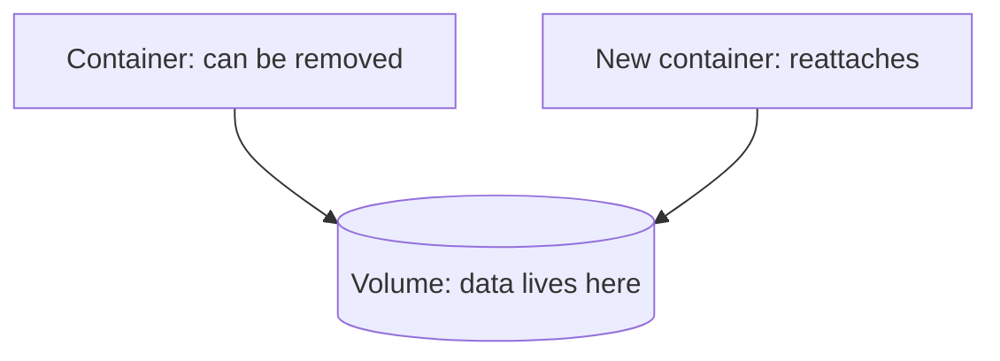

# Data Persistence

## Overview

Persistence is simply the idea that data outlives the thing that created it. Containers are designed to be **disposable**, thrown away and replaced freely, so keeping their data safe takes deliberate handling. This page explains why, and how volumes solve it.

---

## Why data does not persist by default

Everything a container writes goes into its writable layer, and that layer is part of the container itself. Remove the container, and the writable layer is deleted with it. There is nothing malicious or broken about this. It is exactly what "disposable" means.

This is the moment the beginner tutorial made vivid: a change made inside a container vanished the instant the container was removed.

---

## How volumes provide persistence

A **volume** lives outside any single container. Containers attach to it, read and write through it, but the volume itself is independent of them.

Destroy a container and create a fresh one attached to the same volume, and the data is exactly as it was. The container was disposable; the volume was not. That is the whole idea behind giving the database a volume in the intermediate track.

---

## The lifecycle of a volume

A volume is **not** removed when its container is removed. It persists until you delete it explicitly, with `docker volume rm` or `docker compose down -v`. This is deliberate: it means an accidental container removal can never cost you your data. The only way to lose it is to remove the volume on purpose.

---

## Sharing and backups

Because a volume is independent, it enables two more things:

- **Sharing**: more than one container can attach to the same volume, letting them share files.
- **Backups**: since the data lives in a known, managed place rather than trapped inside a container, it can be backed up and restored, which is essential for anything important like a database.

---

## Next

- [Volumes vs Bind Mounts](storage.md) compares the storage types.
- The [Docker Volumes in Practice](../../tutorials/intermediate/docker-volumes.md) tutorial applies all of this.