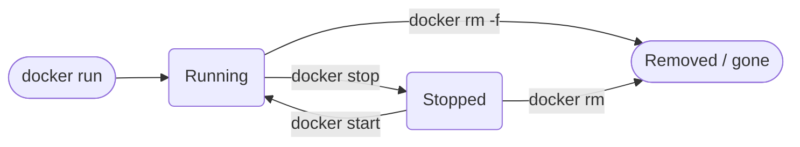

# The Container Lifecycle (Born, Paused, Removed)

You've already started and removed a few containers. Now let's look at the full journey a container goes through, and uncover something surprising: the changes you make inside a container can vanish. Understanding why is the key that unlocks the whole next section of the course. 🔑

## What we will do (in very simple steps)

1. Learn the states a container moves through
2. Start a container and make a change inside it
3. Stop and start it, and watch the change survive
4. Remove it and start fresh, and watch the change disappear

---

## The three states

A container's life is simple. It has three main states:



In kitchen terms:

- **Running**: the meal is cooked and being served. 🍽️
- **Stopped**: the meal is set aside in the fridge. It still exists, and you can reheat it. 🧊
- **Removed**: the meal is thrown in the bin. It's gone for good. 🗑️

The important thing beginners miss: a **stopped** container is not gone. It's just switched off, sitting in the fridge, waiting.

---

## Step 1: Start a container

Let's start nginx again, with a name and a port so we can see it:

```bash
docker run -d -p 8080:80 --name web nginx
```

Open [http://localhost:8080](http://localhost:8080) and you'll see the usual **"Welcome to nginx!"** page.

---

## Step 2: Make a change inside it

Every container gets its own private scratch space on top of the image. Let's write a new welcome message into this container's scratch space:

```bash
docker exec web sh -c 'echo "Hello from inside my container!" > /usr/share/nginx/html/index.html'
```

`docker exec` runs a command **inside** a running container. Refresh your browser, and the page now says **"Hello from inside my container!"** ✨

That change lives only in this one container's scratch space. It did not touch the nginx image at all.

---

## Step 3: Stop and start (the change survives)

Now put the container in the fridge:

```bash
docker stop web
```

Check your running containers:

```bash
docker ps
```

It's empty. But the container is not gone, it's just stopped. Prove it with `docker ps -a`, which shows **all** containers, including stopped ones:

```bash
docker ps -a
```

There's `web`, with a status like `Exited`. Now reheat it:

```bash
docker start web
```

Refresh your browser. Your custom message is **still there**. 🎉 Stopping and starting keeps the container's scratch space intact, because the container still exists.

---

## Step 4: Remove it and start fresh (the change is gone)

Now throw this container in the bin:

```bash
docker rm -f web
```

And cook a brand new one from the same nginx image:

```bash
docker run -d -p 8080:80 --name web nginx
```

Refresh your browser. You're back to the plain **"Welcome to nginx!"** page. 😮

Your custom message is gone. It lived in the old container's scratch space, and when you removed that container, the scratch space went in the bin with it. The new container started completely fresh from the image.

Clean up when you're done:

```bash
docker rm -f web
```

---

## Why this matters 🧠

This is the single most important takeaway in the beginner track:

> **Anything a container writes to its own scratch space is lost the moment that container is removed.**

That's fine for a web server serving fixed pages. But what about a database full of customer orders? You cannot lose that data every time you replace a container. 😰

The answer is **volumes**, a way to store data *outside* any single container so it survives forever. That's the very first topic in the Intermediate track, and now you understand exactly why it exists.

---

## Command recap

| Command | What it does | Kitchen analogy |
|---|---|---|
| `docker run` | Create and start a new container | Cook a fresh meal |
| `docker ps` | List running containers | See what's being served |
| `docker ps -a` | List all containers, including stopped | See the fridge too |
| `docker stop` | Switch a container off | Put the meal in the fridge |
| `docker start` | Switch a stopped container back on | Reheat it |
| `docker rm` | Remove a container for good | Throw it in the bin |
| `docker rm -f` | Force-remove even a running one | Bin it without stopping first |

---

## ✅ Checkpoint

You've finished the beginner track if you can answer:

- After `docker stop web`, is the container gone? *(No, it's stopped. `docker ps -a` still shows it.)*
- You made a change inside a container, then stopped and started it. Is the change still there? *(Yes.)*
- You then removed the container and ran a fresh one. Is the change still there? *(No, it went in the bin with the old container.)*
- Where should important data live so it survives a container being removed? *(In a volume, coming up next.)*

---

## 🩹 Common hiccups

- **`docker ps` shows nothing but you know you made a container**: it's probably stopped, not gone. Use `docker ps -a` to see stopped containers.
- **"name is already in use"**: an old `web` container is still around. Run `docker rm -f web` and try again.
- **`docker start` with no change visible**: make sure you refreshed the browser, and that you started the same container name you changed earlier.

---

**Next up:** [Build a Docker Image](../../intermediate/build-image/) begins the Intermediate track, where you stop borrowing other people's images and start building your own.