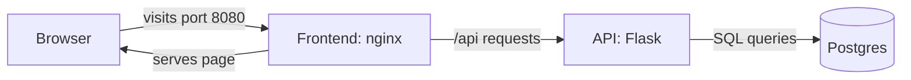

# Full Stack App with Compose

This is the finale. 🏁

Across this course you've built three separate pieces: a **database**, an **API**, and a **frontend**. In this lesson they finally come together into one complete application, running as a single stack with one command. This is the full Snapshot app the whole course has been building toward.

## What we will do (in very simple steps)

1. Connect the frontend to the API
2. Bring the frontend, API, and database into one Compose file
3. Launch the entire stack with a single command
4. Watch a real request flow through all three tiers

---

## The architecture

Here's how the three pieces fit together:



The clever part: only the **frontend** is open to the outside world. The browser talks to the frontend, and the frontend quietly passes any `/api` requests along to the API behind the scenes. The API and database stay private, reachable only inside the stack. That's both cleaner and safer. 🔒

---

## Step 1: Connect the frontend to the API

Go to your frontend folder:

```bash
cd ~/snapshot-frontend
```

Update `src/main.js` so it fetches the photo list from the API and shows it:

```javascript
async function loadPhotos() {
  const response = await fetch("/api/photos");
  const data = await response.json();
  const items = data.photos.map((p) => `<li>${p.title}</li>`).join("");
  document.querySelector("#app").innerHTML = `<ul>${items}</ul>`;
}

loadPhotos();
```

Notice it calls `/api/photos`, not a full address with a port. The frontend's web server will handle passing that along. To make it do so, create a file called `nginx.conf` in the same folder:

```nginx
server {
    listen 80;

    location / {
        root /usr/share/nginx/html;
        index index.html;
        try_files $uri $uri/ /index.html;
    }

    location /api/ {
        proxy_pass http://api:5000/;
    }
}
```

This says: serve the static page normally, but anything starting with `/api/` should be forwarded to the `api` service on port 5000. That `api` name is the Compose service name, resolved automatically, just like in the networking lesson.

Finally, update your frontend `Dockerfile` so it uses this config. Add one line to the second stage:

```dockerfile
# Stage 1: build the static files
FROM node:20 AS build
WORKDIR /app
COPY package.json .
RUN npm install
COPY . .
RUN npm run build

# Stage 2: serve with nginx and proxy the API
FROM nginx:alpine
COPY nginx.conf /etc/nginx/conf.d/default.conf
COPY --from=build /app/dist /usr/share/nginx/html
```

The only new line is the `COPY nginx.conf ...` one, which swaps in your proxy configuration.

---

## Step 2: Create the full-stack project

Make a new folder to hold the stack that ties everything together:

```bash
mkdir ~/snapshot
cd ~/snapshot
```

Create `compose.yaml`:

```yaml
services:
  db:
    image: postgres:16
    environment:
      POSTGRES_PASSWORD: secret
      POSTGRES_DB: snapshot
    volumes:
      - snapshot-data:/var/lib/postgresql/data
      - ./init.sql:/docker-entrypoint-initdb.d/init.sql

  api:
    build: ../my-docker-app
    environment:
      DB_HOST: db
    depends_on:
      - db

  frontend:
    build: ../snapshot-frontend
    ports:
      - "8080:80"
    depends_on:
      - api

volumes:
  snapshot-data:
```

A few things worth noticing:

- `build: ../my-docker-app` and `build: ../snapshot-frontend` point at your existing folders. The `..` means "go up one folder, then into that one," since your apps live next to this project.
- Only `frontend` has a `ports` line. The API and database have **no** published ports, so they're private to the stack. Only the frontend is reachable from your browser.
- `depends_on` starts them in order: database, then API, then frontend.

Then the database seed, `init.sql`, in the same `~/snapshot` folder:

```sql
CREATE TABLE IF NOT EXISTS photos (id serial PRIMARY KEY, title text);
INSERT INTO photos (title) VALUES ('sunset'), ('mountain');
```

---

## Step 3: Launch the whole stack

From inside `~/snapshot`:

```bash
docker compose up -d --build
```

Compose builds your API and frontend images, pulls Postgres, creates the network and volume, and starts all three services in order. Check they're all up:

```bash
docker compose ps
```

You should see `db`, `api`, and `frontend`, all running. 🎉

---

## Step 4: See it all work together

Open your browser and go to:

```
http://localhost:8080
```

You'll see your **Snapshot Gallery** page, and this time it lists **sunset** and **mountain**, fetched live from the database.

Take a moment to appreciate the journey that one page load just took:

1. Your browser asked the **frontend** for the page
2. The page's code asked for `/api/photos`
3. The frontend **proxied** that to the **API**
4. The API **queried** the database
5. The rows travelled all the way back to your screen

Three containers, three tiers, one seamless result. That is a real, modern web application. 👏

---

## Step 5: Tear it down

```bash
docker compose down
```

Your `snapshot-data` volume stays, so the data is safe for next time. To wipe everything including the data, use `docker compose down -v`.

---

## ✅ Checkpoint

You've completed this lesson, and the tutorials, if:

- Your frontend calls `/api/photos` and the nginx config proxies it to the API
- `docker compose up -d --build` started all three services
- `http://localhost:8080` showed the gallery listing your photos from the database
- You can trace a single request through frontend, API, and database

---

## 🩹 Common hiccups

- **Page loads but the list is empty or errors**: give the stack a few seconds, then refresh. Check `docker compose logs api` and `docker compose logs db`.
- **Build fails on the `..` paths**: run `docker compose up` from inside `~/snapshot`, and confirm `my-docker-app` and `snapshot-frontend` sit next to it in your home folder.
- **`/api` requests fail**: check the `nginx.conf` `proxy_pass` line points to `http://api:5000/` and that the service is named `api` in the Compose file.
- **Old data or no seed**: for a clean start, run `docker compose down -v` to remove the volume, then `docker compose up -d --build` so `init.sql` runs fresh.

---

## 🎓 Course complete

You've finished the entire Docker course. Look back at how far you've come. You started by running someone else's `hello-world`, and you can now:

- Build, tag, and share your own images
- Configure containers and give them lasting storage
- Connect multiple services into a working system
- Produce lean, production-minded images
- Debug confidently when things go wrong
- Run and deploy a complete three-tier application

That is a genuine, job-relevant skill set. 🙌

**Where next:** every container you built here is exactly what **Kubernetes** orchestrates across many machines, healing and scaling them automatically. You've built the perfect foundation. The [Kubernetes course](../../../kubernetes/) is your next step.