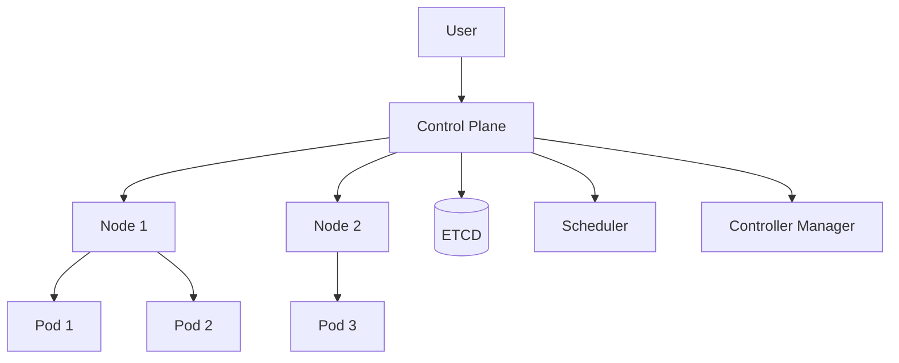

# Kubernetes Overview

Kubernetes is an **open-source platform for automating deployment, scaling, and management of containerized applications**.  
It allows you to reliably run applications across clusters of machines, handling **scaling, self-healing, and load balancing** automatically.

This section will guide you from the **basics to advanced topics**, helping you understand the architecture, deploy your first workloads, and solve real-world problems.

---

## Why Learn Kubernetes?

- **Automate deployment**: Reduce manual intervention and human error.  
- **Scale seamlessly**: Automatically adjust resources based on demand.  
- **Manage complex systems**: Handle multiple services, nodes, and containers with ease.  
- **Industry standard**: Used by companies of all sizes for production-grade workloads.  

> 💡 Tip: If you’re familiar with Docker, Kubernetes builds on top of containerization principles to manage containers at scale.

---

## High-Level Architecture

### Key Components:

- **Control Plane:** Manages the cluster, makes scheduling decisions, and maintains cluster state.
- **Nodes:** Run containerized applications inside **Pods.**
- **Pods:** The smallest deployable units, holding one or more containers.
- **ETCD:** Stores the cluster state and configuration.
- **Scheduler & Controllers:** Ensure desired state is maintained and workloads are placed appropriately.

### What You’ll Learn in This Section
| Category | Description                                                     |
|--------------------|-------------------------------------------------------|
| Tutorials	         | Step-by-step guides: create your first cluster, deploy pods, services, and applications. |
| How-To Guides      | Recipes for common tasks: scaling deployments, troubleshooting, and injecting configurations. |
| Explanations       | Deep dive into Kubernetes architecture, objects, storage, networking, and security. |
| Reference	CLI      | commands, manifests, and configuration options for quick lookup. |

### Suggested Learning Path

**1. Start with Tutorials:**
    - “What is Kubernetes?” – understand the big picture
    - Install Minikube and create your first cluster
    - Deploy a Pod and a Service
**2. Explore How-To Guides:**
    - Scaling deployments
    - Managing ConfigMaps and Secrets
    - Troubleshooting pods and services
**3. Dive into Explanations:**
    - Learn how the control plane and nodes interact
    - Understand pods, deployments, services, and persistent storage
**4. Use Reference:**
    - Quickly look up CLI commands and YAML manifests
    - Check best practices for production configurations

---

### Quick Tips

- Combine with Docker: Kubernetes orchestrates containers; Docker is the runtime.
- Hands-on practice matters: Use Minikube or Kind for local clusters.
- Keep diagrams handy: They help visualize clusters and workflows.
- Use this documentation as a guide: Start with tutorials, then explore how-to and explanation pages.

---

🚀 Ready to start? Jump into the Tutorials and create your first Kubernetes cluster!