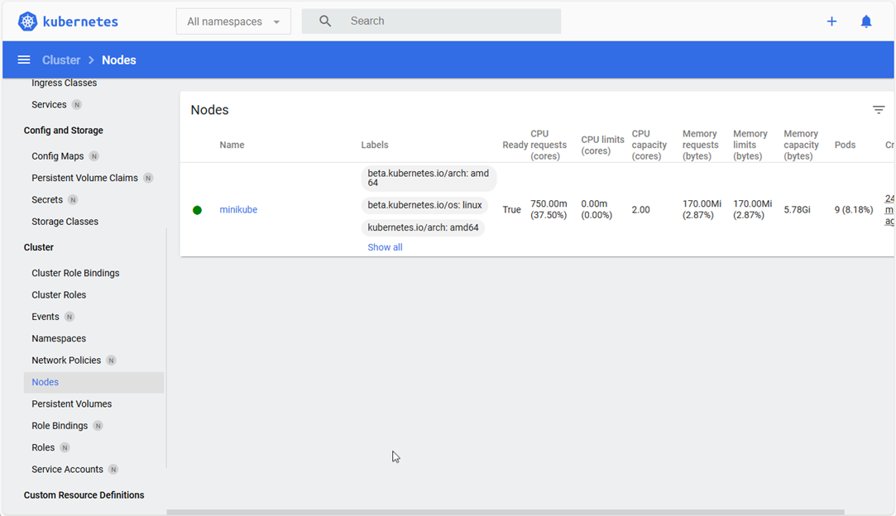
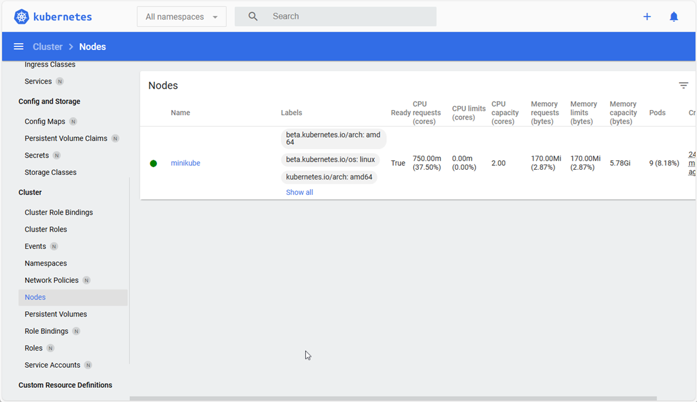

## Your First Tiny Kubernetes Cluster (Local on Your Computer)

Now that we understand the big picture (containers + the pizza chain manager), let’s see Kubernetes in action.

We are going to create a **tiny Kubernetes cluster** right on your own computer.  
It’s safe, free, and only takes just a few minutes to install.

### What we will do (in very simple steps)

1. Install a tool called **Minikube** (it creates a fake "single restaurant" Kubernetes cluster on your laptop)
2. Start the cluster with one command
3. Check that it’s alive with another command
4. See the dashboard, a pretty web page that shows what’s happening

That’s it for this part. No containers or apps yet, just making sure the "head office" is open.

### Step 1: Install Minikube
Minikube is the easiest way for beginners to try Kubernetes locally.

#### a. Choose your operating system:
Run the following commands, based on your OS (Windows/Mac/Linux)
##### Windows
Easiest: Install Chocolatey (package manager) first if you don’t have it:
1. Open PowerShell as Administrator (right-click → Run as administrator)
   
2. Install Chocolatey (one-time, if not already installed):
   ```PowerShell
   Set-ExecutionPolicy Bypass -Scope Process -Force
   [System.Net.ServicePointManager]::SecurityProtocol =
   [System.Net.ServicePointManager]::SecurityProtocol -bor 3072; iex ((New-Object
   System.Net.WebClient).DownloadString('https://community.chocolatey.org/install.ps1'))
   ```
   
  3. Then install Minikube:
  ``` powershell
  choco install minikube
  ```

#### macOS
1. With Homebrew (recommended):
```bash
brew install minikube
```

#### Linux
1. Quick one-liner (most common distributions):
```bash
curl -LO https://storage.googleapis.com/minikube/releases/latest/minikube-linux-amd64 sudo install minikube-linux-amd64 /usr/local/bin/minikube && rm minikube-linux-amd64
```
  
#### b. Windows/macOS/Linux
After installing, run the following command to verify that Minikube has been installed, and check the version:
```bash
minikube version
```

**Note:** (If you run into issues, search “install minikube [your OS]” official docs are very good.)


### Step 2: Start your tiny cluster
Open a terminal (PowerShell on Windows, Terminal on macOS/Linux) and run the following command:
```bash
minikube start
```

- This downloads a small virtual machine + Kubernetes components (first time takes 2–5 minutes)
- After that it usually starts in ~30 seconds
- You should see output similar to the following:
```console
minikube v1.34.0 on Microsoft Windows 11 Home Single Language 10.0.26100
Using the docker driver based on user configuration
Starting control plane node minikube in cluster minikube
Creating docker container (CPUs=2, Memory=2200MB) ...
Preparing Kubernetes v1.31.0 on Docker 24.0.9 ...
Verifying Kubernetes components...
Done! kubectl is now configured to use "minikube" cluster```
```

Congratulations! 
You now have a real (tiny) Kubernetes cluster running on your computer.


### Step 3: Check that it’s alive
Now that Minikube is installed, we want to check that it is running
Run the following command:
```bash
kubectl get nodes
```


You should see something like:
```console
NAME       STATUS   ROLES           AGE     VERSION
minikube   Ready    control-plane   2m30s   v1.31.0
```

- This means: "Show me all the restaurants (nodes) in the pizza chain"
- You have **one restaurant** called minikube and it’s **Ready** (healthy)


### Optional: See a pretty dashboard
1. If you want to see the Kubernetes browser dashboard, run the following bash command:
```bash
minikube dashboard
```

- This opens a web browser showing the Kubernetes dashboard

- You’ll see graphs, lists of things running (right now almost nothing), and a nice visual of your tiny cluster



2. Close the browser tab when done, the dashboard keeps running in the background until you stop Minikube.



#### Clean up (when you’re done playing)
1. To stop the cluster run this Bash Command (saves CPU/RAM):
```bash
minikube stop
```

2. To delete it completely (start fresh next time):
```bash
minikube delete
```


#### What we achieved
- We turned your computer into a **real Kubernetes cluster** (even if just one node)
- We used **kubectl** the main command-line tool to talk to Kubernetes
- We proved the "head office" is listening

Next time we will actually **deploy our first pizza** (run a simple container inside this cluster).


[→ Continue to Part 3: Run Your First Container (Pod)](../01-beginners/03-your-first-pod-and-deployment.md)