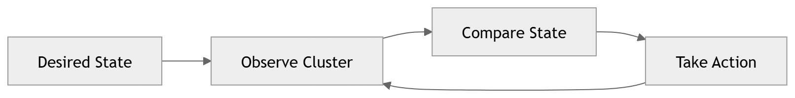

# Kubernetes Control Plane

The control plane is responsible for **managing the entire Kubernetes cluster**.

It makes decisions about:

- scheduling workloads
- responding to failures
- scaling applications
- maintaining cluster state

Without the control plane, worker nodes cannot function as part of the cluster.

---

## Core Control Plane Components

<div class="mermaid">
flowchart TB

    User["kubectl / API Client"]

    APIServer["API Server"]
    ETCD["etcd"]
    Scheduler["Scheduler"]
    Controller["Controller Manager"]

    User --> APIServer

    APIServer --> ETCD
    APIServer --> Scheduler
    APIServer --> Controller
</div>

Each control plane component has a specific responsibility.


| Component | Description |
|----------|-------------|
| kube-apiserver | Central API for the cluster |
| etcd | Distributed key-value store |
| kube-scheduler | Assigns pods to nodes |
| kube-controller-manager | Runs cluster controllers |

---

## API Server

The **API Server** is the central communication hub of Kubernetes.

All interactions with the cluster go through this component.

Example command:

```bash
kubectl apply -f deployment.yaml
```

This command sends a request to the API server.

The API server:

1. validates the request
2. authenticates the user
3. stores the configuration in etcd
4. notifies other components of the change

---


## etcd

`etcd` stores the entire cluster state.

This includes:

- deployments
- pods
- services
- secrets
- configuration


Because etcd stores critical cluster data, it must be:

- highly available
- backed up regularly
- protected from unauthorized access

---


## Scheduler

The scheduler determines where pods should run.

When a new pod is created, the scheduler selects the most appropriate node based on factors such as:

- CPU availability
- memory availability
- node labels
- affinity rules
- taints and tolerations

Once a node is selected, the scheduler instructs that node to start the pod.

---


## Controller Manager

The controller manager runs a set of controllers responsible for maintaining cluster state.

Controllers continuously monitor the system and take action when the actual state differs from the desired state.

Examples include:

| Controller | Responsibility |
|------------|----------------|
| Deployment Controller | Ensures correct number of pods |
| ReplicaSet Controller | Maintains pod replicas |
| Node Controller | Monitors node health |

Controllers operate using control loops that constantly reconcile cluster state.


---
## Control Loop Model


This continuous feedback loop is the foundation of Kubernetes automation.

---

## Key Takeaway

The control plane acts as the brain of the Kubernetes cluster, coordinating scheduling, monitoring system health, and ensuring workloads run as expected.

---
