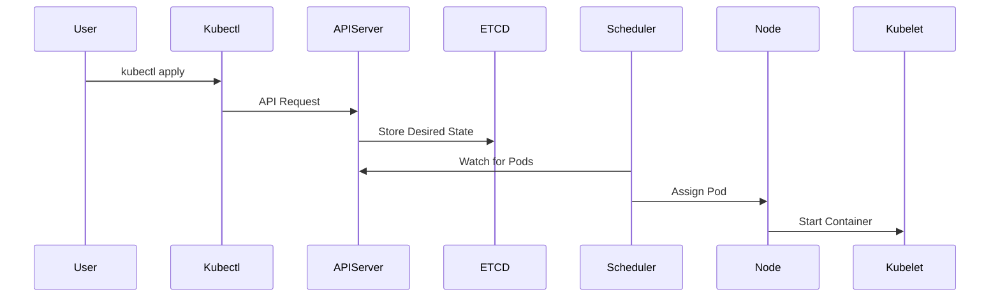

# The Kubernetes Mental Model


```markdown
## Kubernetes Request Lifecycle




Many beginners struggle with Kubernetes because they try to understand it as a collection of commands.

In reality, Kubernetes works best when you think of it as a **declarative control system**.

You do not tell Kubernetes *how to do something*.  
You tell Kubernetes **what the desired state should be**, and the system continuously works to maintain that state.

---

## Desired State vs Actual State

Kubernetes constantly compares two things:

| Concept | Description |
|------|-------------|
| Desired State | What you declare in YAML configuration |
| Actual State | What is currently running in the cluster |

When these differ, Kubernetes automatically attempts to correct the difference.

Example:

You declare:
replicas: 3


If only 2 pods are running, Kubernetes creates another one.

If 4 pods exist, Kubernetes removes one.

This continuous reconciliation is handled by **controllers**.

---

## Kubernetes is a Control Loop

Internally, Kubernetes operates using many **control loops**.

A control loop repeatedly performs three steps:

1. Observe current cluster state
2. Compare with desired state
3. Take action to reconcile differences

Example:

Deployment Controller:
Desired: 3 pods
Actual: 2 pods
Action: Create 1 pod


This loop runs constantly.

---

## You Interact With the API Server

When you run a command such as:
kubectl apply -f deployment.yaml


You are **not directly starting containers**.

Instead:

1. `kubectl` sends a request to the **API Server**
2. The API Server stores the configuration in **etcd**
3. Controllers detect the new desired state
4. Controllers take action to create resources

The API server is therefore the **central control point** of the cluster.

---

## Controllers Do the Work

Kubernetes controllers are responsible for enforcing the desired state.

Examples include:

| Controller | Responsibility |
|-----------|---------------|
| Deployment Controller | Ensures correct number of pods |
| ReplicaSet Controller | Maintains pod replicas |
| Node Controller | Monitors node health |
| Job Controller | Manages batch jobs |

Controllers continuously watch the cluster for changes.

---

## Scheduling

Pods do not automatically run on nodes.

Instead, the **scheduler decides where pods should run**.

The scheduler considers factors such as:

- available CPU and memory
- node constraints
- affinity rules
- taints and tolerations

Once a node is selected, the **kubelet** on that node starts the container.

---

## Nodes Run the Workloads

Worker nodes are responsible for actually running containers.

Each node includes:

| Component | Role |
|-----------|------|
| kubelet | Communicates with control plane |
| container runtime | Runs containers |
| kube-proxy | Handles networking rules |

The kubelet ensures the containers described by the pod specification are running.

---

## The System is Self-Healing

Kubernetes constantly monitors cluster health.

If something fails, Kubernetes attempts to correct the problem automatically.

Examples:

| Failure | Kubernetes Response |
|-------|---------------------|
| Pod crashes | Pod restarted |
| Node fails | Pods rescheduled to other nodes |
| Container unhealthy | Container restarted |

This behavior is what makes Kubernetes highly resilient.

---

## The Kubernetes Workflow

In practice, Kubernetes operations follow this pattern:

Write YAML
↓
Apply configuration
↓
API Server stores desired state
↓
Controllers detect changes
↓
Scheduler assigns pods
↓
Nodes run containers
↓
Controllers maintain desired state


This workflow happens continuously.

---

## Key Takeaway

Kubernetes is not a command-driven system.

It is a **declarative platform that continuously reconciles desired state with actual state**.

Once this mental model clicks, Kubernetes becomes much easier to understand and operate.

---

## Next Concepts

To deepen your understanding, explore:

- Kubernetes Architecture
- Pods and Workloads
- Services and Networking
- Persistent Storage


---