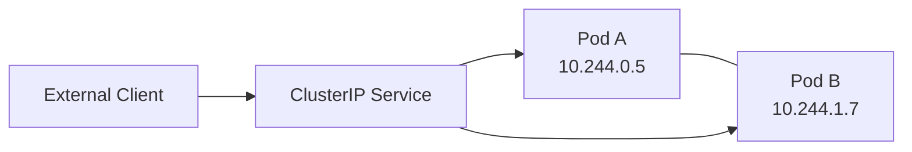

```markdown
## Pod Networking Model


```mermaid
flowchart LR

    PodA["Pod A\n10.244.0.5"]
    PodB["Pod B\n10.244.1.7"]

    PodA --- PodB

    Service["ClusterIP Service"]

    User["External Client"]

    User --> Service
    Service --> PodA
    Service --> PodB
```

