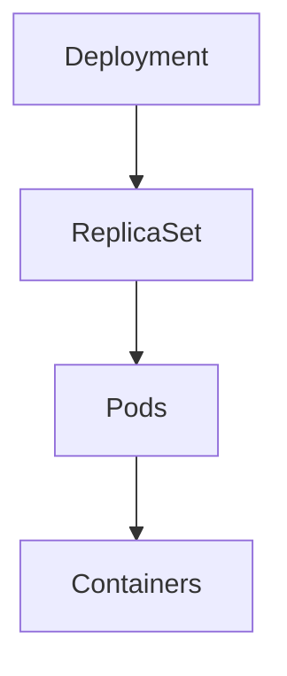

# Kubernetes Workloads

Workloads are the objects responsible for **running applications inside a Kubernetes cluster**.

They define how containers are deployed, scaled, and maintained.

In Kubernetes, applications are not run directly on nodes. Instead, they are managed through **workload resources** that describe the desired state of the system.

---

## Core Workload Types

Kubernetes provides several workload resources, each designed for different use cases.

| Workload | Purpose |
|--------|--------|
| Pods | Smallest deployable unit |
| ReplicaSets | Maintain a stable number of running pods |
| Deployments | Manage application updates and scaling |
| StatefulSets | Manage stateful applications |

---

## Why Workloads Exist

Containers can fail, nodes can crash, and applications need to scale.

Workloads allow Kubernetes to automatically:

- restart failed containers
- maintain the correct number of replicas
- perform rolling updates
- ensure high availability

This is part of Kubernetes’ **self-healing architecture**.

---

## Relationship Between Workloads

The most common application pattern looks like this:

---